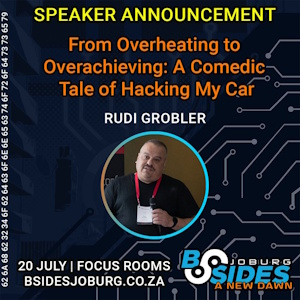

# BSides

**BSides** is a community-driven events where professionals share ideas, research, and experiences. Each event reflects its local cybersecurity scene, offering talks, workshops, and networking for both experts and newcomers.

## **[2024](2024)** - From Overheating to Overachieving: A Comedic Tale of Hacking My Car

- 20th Jul 2024, Johannesburg

I shared my humorous and enlightening journey into car hacking. After my car's overheating issues puzzled multiple repair shops, I took matters into my own hands with an OBD connector and Arduino. I discussed reverse engineering basics and how I decoded the car's CAN bus signals, sharing my technical insights and amusing misadventures along the way.