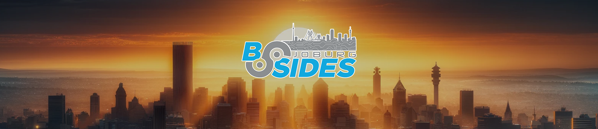

# BSides

**BSides** is a community-driven events where professionals share ideas, research, and experiences. Each event reflects its local cybersecurity scene, offering talks, workshops, and networking for both experts and newcomers.

**Community Focused**: Unlike larger commercial conferences, BSides events are organized by the community, for the community. This grassroots approach encourages active participation and fosters a more inclusive and engaging environment.

**Accessibility**: BSides events are generally more affordable or free to attend, making them accessible to a wider range of participants, including students, hobbyists, and professionals from various backgrounds.

**Knowledge Sharing**: The conferences feature presentations, workshops, and discussions on a wide range of cybersecurity topics. These can include technical talks on new vulnerabilities, defensive strategies, incident response, ethical hacking, and emerging threats.

**Networking Opportunities**: Attendees have the chance to meet and connect with other security professionals, researchers, and enthusiasts. This can lead to collaborations, job opportunities, and the sharing of ideas and best practices.

**Local and Global Reach**: While BSides events are held in various cities around the world, each event reflects the unique interests and expertise of the local community. This results in a diverse array of topics and perspectives across different BSides conferences.

**Interactive Format**: In addition to traditional presentations, BSides events often include hands-on workshops, Capture The Flag (CTF) competitions, and other interactive activities that encourage active learning and engagement.

**Inclusive Atmosphere**: The community-driven nature of BSides fosters an inclusive atmosphere where newcomers and veterans alike can feel welcome and valued. This inclusivity helps to build a stronger and more diverse cybersecurity community.

BSides events have grown significantly since the first one was held in 2009, becoming an important part of the cybersecurity conference landscape.

## **[2024](2024)** - From Overheating to Overachieving: A Comedic Tale of Hacking My Car

- **Date**: 20th Jul 2024
- **Location**:  Focus Rooms, Johannesburg, Heaton Lane Longlake 20, Modderfontein
- **Website**: https://bsidesjoburg.co.za/bsides-2024/

I shared my humorous and enlightening journey into car hacking. After my car's overheating issues puzzled multiple repair shops, I took matters into my own hands with an OBD connector and Arduino. I discussed reverse engineering basics and how I decoded the car's CAN bus signals, sharing my technical insights and amusing misadventures along the way.