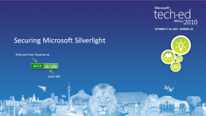
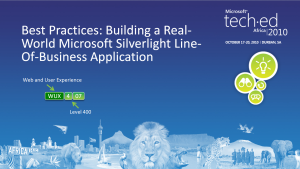

## Microsoft TechEd Africa

**Tech-ed** Africa was one of the largest technology conferences on the continent, hosted annually by Microsoft. It brought together thousands of IT professionals to explore the latest tools, platforms, and innovations.

### Using the MVVM Design Pattern with the Microsoft Visual Studio 2010 XAML Designer
- 18 Oct 2010 - Durban

[Slides](DTL323_MVVM_VS2010_Grobler.pdf)

### Powering Rich Internet Applications: Windows Server AppFabric, Web Services, and Microsoft Silverlight
- 19 Oct 2010 - Durban

### Securing Microsoft Silverlight
- 19 Oct 2010 - Durban

[Slides](WUX310_Securing_Silverlight_Grobler.pdf)

### Best Practices: Building a Real-World Microsoft Silverlight Line-Of-Business Application
- 20 Oct 2010 - Durban

[Slides](WUX407_Best_Practices_Grobler.pdf)

### Hack Proofing your Microsoft ASP.NET Web Forms and MVC Applications
- 17 Oct 2011 - Durban

### Mango MUST HAVE developer features
- 18 Oct 2011 - Durban

### Effective Validation Techniques with MVVM in Silverlight
- 18 Oct 2011 - Durban

### Expert Lessons: Top Tips for Building a Successful Windows Phone Application
- 19 Oct 2011 - Durban

### Windows Phone 8: XAML Application Development
- 16-19 April 2013 - Durban