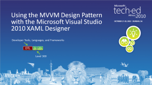

## Microsoft TechEd Africa

**Tech-ed** Africa was one of the largest technology conferences on the continent, hosted annually by Microsoft. It brought together thousands of IT professionals to explore the latest tools, platforms, and innovations.

### [DTL323](DTL323) - Using the MVVM Design Pattern with the Microsoft Visual Studio 2010 XAML Designer
- 18 Oct 2010 - Durban

This presentation explores the application of the Model-View-ViewModel (MVVM) design pattern within the context of Microsoft Visual Studio 2010, emphasizing its benefits for building rich, maintainable, and testable user interfaces (UIs). The session provides an in-depth analysis of MVVM components—Model, ViewModel, and View—and illustrates how data binding, commanding, and separation of concerns facilitate a clean UI architecture. It discusses the differences between rich and poor models, highlights the importance of design tools like Visual Studio and Blend, and introduces the Basic XAML Framework (Bxf), a lightweight toolkit to streamline MVVM implementation across Silverlight, WPF, and Windows Phone 7. Practical demonstrations, resource links, and best practices guide developers in adopting MVVM effectively while minimizing reliance on code-behind and enhancing collaboration between designers and developers.

### Powering Rich Internet Applications: Windows Server AppFabric, Web Services, and Microsoft Silverlight
- 19 Oct 2010 - Durban

### [WUX310](WUX310) - Securing Microsoft Silverlight
- 19 Oct 2010 - Durban

This presentation provides an in-depth overview of security considerations and best practices for developing and deploying Microsoft Silverlight applications. It covers the various vectors through which Silverlight applications can be compromised, including client-side vulnerabilities, network security, and intellectual property protection. The session discusses strategies for securing the client, protecting assets such as code and XAML, and safeguarding data stored locally or transmitted over the network. Emphasis is placed on obfuscation techniques, authentication mechanisms, cross-domain access policies, and secure service communication. Additionally, it explores different approaches to protecting Silverlight application files (XAPs) via authentication, encryption, and domain policies, as well as securing WCF Data Services and network requests using browser and client HTTP stacks. Practical demos and best practices aim to help developers enhance the security posture of their Silverlight applications.

### [WUX407](WUX407) Best Practices: Building a Real-World Microsoft Silverlight Line-Of-Business Application
- 20 Oct 2010 - Durban

This session offers comprehensive best practices for developing robust, maintainable, and scalable Line-of-Business (LOB) applications using Microsoft Silverlight. Presented by Rudi Grobler, it emphasizes structured architectural patterns, particularly the Model-View-ViewModel (MVVM) pattern, to manage application complexity. The presentation covers essential topics such as consistent pattern adoption, effective data binding in nested controls, user notification mechanisms for success and failure, the use of service agents for clean service calls, and extending built-in controls to meet specific business needs. Through practical demonstrations and real-world insights, attendees learn how to implement these strategies to create professional-grade Silverlight applications that are easier to test, extend, and maintain.

### Hack Proofing your Microsoft ASP.NET Web Forms and MVC Applications
- 17 Oct 2011 - Durban

### Mango MUST HAVE developer features
- 18 Oct 2011 - Durban

### Effective Validation Techniques with MVVM in Silverlight
- 18 Oct 2011 - Durban

### Expert Lessons: Top Tips for Building a Successful Windows Phone Application
- 19 Oct 2011 - Durban

### [2013](2013) - Windows Phone 8: XAML Application Development
- 16-19 April 2013 - Durban

This presentation, delivered by **Rudi Grobler** at **Microsoft TechEd Africa 2013**, provides a comprehensive guide to **XAML-based application development** for **Windows Phone 8**. The session covers the fundamentals of XAML, new features in Windows Phone 8, project infrastructure, key controls (e.g., `LongListSelector`, `Maps`), and performance optimizations. It also addresses compatibility with **Windows Phone 7** and highlights modern development practices like **async/await** and **Portable Class Libraries (PCL)**. Live demonstrations illustrate practical implementations, while the talk concludes with resources for further learning and community engagement.  
