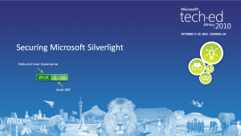

# TechEd 2010 - "Securing Microsoft Silverlight" (WUX310)

## Abstract

This presentation provides an in-depth overview of security considerations and best practices for developing and deploying Microsoft Silverlight applications. It covers the various vectors through which Silverlight applications can be compromised, including client-side vulnerabilities, network security, and intellectual property protection. The session discusses strategies for securing the client, protecting assets such as code and XAML, and safeguarding data stored locally or transmitted over the network. Emphasis is placed on obfuscation techniques, authentication mechanisms, cross-domain access policies, and secure service communication. Additionally, it explores different approaches to protecting Silverlight application files (XAPs) via authentication, encryption, and domain policies, as well as securing WCF Data Services and network requests using browser and client HTTP stacks. Practical demos and best practices aim to help developers enhance the security posture of their Silverlight applications.

## Summary

- **Security Vectors in Silverlight**:
  - Client-side vulnerabilities include code, XAML, assets, and secrets.
  - Network threats involve hackers, eavesdroppers, and malicious actors monitoring traffic.
  - Server and firewall security are critical to protect backend services and infrastructure.

- **Securing the Client**:
  - Silverlight applications are packaged as XAP files containing code, embedded XAML, resources, and libraries.
  - Protecting intellectual property involves obfuscation, code signing, and minimizing sensitive data on the client.
  - Obfuscation tools like Dotfuscator and CodeFort can rename resources and compress assemblies to prevent tampering and reverse engineering.

- **Protecting the XAP Files**:
  - Treat XAPs as web files; apply standard web security measures including forms, Windows, or token-based authentication.
  - For applications with login, XAPs should be accessible anonymously, with runtime composition and tamper detection.
  - Sign XAPs or verify checksums to detect tampering.

- **Authentication and Authorization Strategies**:
  - Use ASP.NET AuthenticationService (WCF-based) for login validation.
  - Leverage forms authentication cookies, Windows authentication, or token-based schemes.
  - Protect services with token, cookie, or NTLM-based security, and secure each method appropriately.

- **Isolated Storage Security**:
  - Avoid storing secrets in isolated storage; if necessary, encrypt using AES.
  - Recognize that isolated storage is discoverable and limited in size.

- **Securing Services**:
  - Apply security measures such as token, cookie, or NTLM authentication for services.
  - Enable cross-domain access policies via `clientaccesspolicy.xml` to allow secure cross-domain calls.
  - Secure WCF DataServices with entity set access rules and query interceptors.

- **Network Communication Security**:
  - Silverlight supports two network stacks: Browser HTTP Stack and Client HTTP Stack.
  - Browser stack utilizes browser cookies, NTLM, and supports only GET/POST.
  - Client stack offers more control, supports PUT/DELETE, custom cookies, and all HTTP methods.
  - Use WebRequest and WebRequestCreator to configure and utilize the client HTTP stack.

- **Best Practices & Resources**:
  - Regularly update security policies, sign application packages, and use encryption.
  - Understand the limitations of the client environment and network stack.
  - Access additional resources, sessions, and community support via Microsoft and related sites.

---

[Slides](slides.pdf)